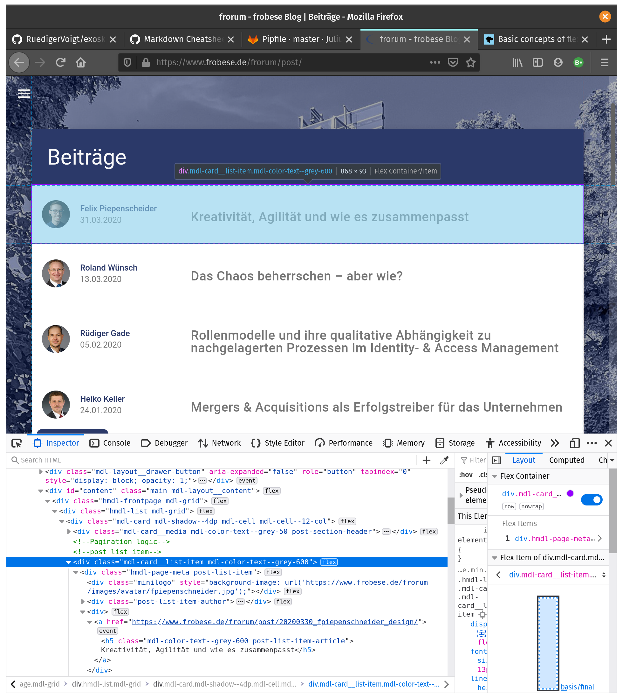

# Web Crawling: Datenbeschaffung im Internet

In Zeiten von Big Data und Machine Learning ist es Konsens, dass viele Entscheidungen durch die Verwendung von Daten verbessert oder überhaupt erst möglich werden. Wo aber diese Daten herkommen ist nicht ganz so klar. Wenn eigene Datenbestände nicht vorhanden sind ... 

Etablierte Unternehmen können auf große, wachsende und gut integrierte Datenbestände zugreifen. Darüber hinaus gibt es eine Vielzahl öffentlicher und kommerzieller Datenbanken, auf die nicht nur komfortabel per API zugegriffen werden kann, sondern die auch schon einen Teil der Auswertung übernehmen.

In der Praxis kommt man aber schnell an einen Punkt, an dem Daten die man sich zur Auswertung wünscht, nicht ausreichend oder gar nicht vorhanden sind. Hier kann es sich lohnen auch unstrukturierte Daten wie Bücher, Artikel oder eben Internetseiten in die Betrachtung einzubeziehen. Letztere sind durch HTML Tags und IDs zumindest teilweise strukturiert.

## Begrifflichkeit

Web Crawling wird häufig mit großen Suchmaschinen wie Google in Verbindung gebracht, deren Crawler das Internet indizieren. Ein Crawler startet mit einem bekannten Stamm an Internetseiten und sammelt erst auf diesen bereits bekannten Seiten Links zu weiteren, vorher noch unbekannten, Webseiten. Auf diese Weise erreicht der Crawler jede Webseite die auf irgendeine Weise in die Link Struktur des Internets eingebunden ist. Dabei muss er so robust programmiert sein, dass auch unbekannte Seiten zuverlässig verarbeitet werden können.

Web Scraping beschäftigt sich mit der Extraktion von Informationen von einer Webseite. Das muss nicht automatisiert passieren - ist es aber meistens. Jeder Crawler muss Informationen von einer Webseite extrahieren und verarbeiten, ist also auch ein Scraper. Jedes nicht triviales Scraping Unterfangen navigiert zwischen mehreren URLs und hat so auch eine crawling Komponente. Im folgenden verwenden wir der Einfachheit halber nur den allgemeineren Begriff "Crawling".

## Beispiel

Nehmen wir als praktisches Beispiel eine Privatperson, die für einen neuen Job in eine unbekannte Stadt zieht und nun auf der Suche nach einer Wohnung ist. Diese Person kann sich auf verschiedenen Internetseiten über das Wohnungsangbot informieren und sich auch eine Benachrichtigung für neue Angebote einrichten. Um die Suche so effizient wie möglich zu gestalten wollen wir aber einen Zugriff auf alle Daten gesammelt, an einem Ort haben und uns zusätzliche Metriken wie die Entfernung zum Arbeitsort und die Mietkosten relativ zum Durchschnitt der Stadt ausgeben lassen. 

## Setup

Zuerst brauchen wir eine Datenbank um die Ergebnisse dauerhaft zu speichern. Für kleine Projekte oder zum testen und entwickeln kann man SQLite gut einsetzen. SQLite ist als dateibasierte Datenbank schnell einsatzbereit ist aber aus dem gleichen Grund weniger skalierbar und nicht einfach in einem Netzwerk einzusetzen. PostgreSQL ist ein Datenbankserver mit integrierter Nutzerverwaltung und bietet außerdem eine fast perfekte Abdeckung des SQL-Standards. Wir werden hier eine Postgres Instanz verwenden, grundsätzlich gilt aber jede SQL Datenbank die man gut kennt ist eine gute Wahl. 

Für die Datenverarbeitung nutzen wir das im Bereich Data Science sehr populäre Python3. Neben einer umfassenden Standardbibliothek bietet Python ein ausgereiftes Ökosystem von externen Bibliotheken, dem Paketmanager pip und Bindings zu anderen Programmiersprachen wie C. Hier einige Beispiele:

- Pandas ist eine Bibliothek mit Datenstrukturen und Funktionen zur Verarbeitung von multi-dimensionalen Matrizen. Die wichtigste Datenstruktur ist dabei der DataFrame.

- TensorFlow ist eine hardwarenahe Plattform für maschinelles Lernen. Der Zugriff auf die C++ Kernfunktionalität von TensorFlow erfolgt entweder direkt per Python Code oder über weiter abstrahierende Frameworks wie Keras.

- Jupyter Notebooks bietet die Möglichkeit Python Code in Echtzeit auszuführen, anzupassen und ihn mit Markdown Text und Visualisierungen in einer Datei zusammenzufassen und zu teilen. Das ist insbesondere in der Lern- und Entwicklungsphase praktisch.

- Darüber hinaus gibt es eine Vielzahl an Anwendunsfällen für Python Programme. Von der Webentwicklung (Flask, Django) bis zur Entwicklung von GUI Apps (tkinter).


### Datenbank
Nach der Installtion von PostgreSQL können wir eine Datenbank "crawler-db" aufsetzen und einen Datenbanknutzer "crawler" erstellen:

```bash
createuser frorum
createdb frorum_db
```

Anschließend öffnen wir das Postgres Kommandozeilen Interface mit `psql` und konfigurieren die Datenbank mit standard SQL:

```SQL
ALTER USER frorum WITH ENCRYPTED PASSWORD 'sicheresPasswort';
GRANT ALL PRIVILEGES ON DATABASE frorum_db TO frorum;
ALTER DATABASE frorum_db OWNER TO frorum;
```

Mit `\l` vergewissern wir uns das alles geklappt haben und schließen psql mit `\q`. Die Datenbank ist jetzt bereit und kann von uns bzw. unserem Code befüllt werden.

### Python
Um eine einheitliche Entwicklungsumgebung auch auf mehreren Maschinen zu gewährleisten nutzen wir einen Umgebungsmanager. Wir installieren pipenv und erstellen eine neue virtuelle Umgebung:

```bash
pip3 install pipenv
pipenv --python 3
```

pipenv erstellt ein Pipfile in dem alle benötigten Pakete aufgelistet sind. Momentan steht da nur Python 3.8 drin. Um uns das Parsen von HTML-Dokumenten zu erleichtern fügen wir noch BeautifulSoup4 und lxml hinzu. Um die Postgres-Datenbank per Python Code zu steuern brauchen wir noch das passende Interface psycopg2. Anschließend können wir die virtuelle Umgebung starten:

```bash
pipenv install bs4 lxml psycopg2
pipenv shell
```

## Erforschung
Um einen ersten Eindruck der Struktur der Ziel-Webseite zu bekommen bietet sich das Inspektor-Tool eines Browsers an. Hier sehen wir, dass die [Beitragsliste](https://www.frobese.de/frorum/post/) als Flexbox Layout angelegt ist und jedes Element dieser Tabelle ein div-Tag mit `class="mdl-card ..."` ist.


Zur weiteren Erforschung installieren wir Jupyter und starten ein neues Notebook:
```bash
pipenv install jupyterlab
jupyter notebook
``` 


## Ethisches Web Crawling
- user agent als bot markieren / info hinterlegen und Kontaktmöglichkeit
- robots.txt beachten; Die meisten Webseiten ist das egal, größere Seiten mit viel Traffic können robots aber einschränken
- nicht DoS'en; Keine übermäßige Last für die Server/Infrastruktur des Betreibers erzeugen. Über lange Zeiträume scrapen und Pausen ywischen Requests lassen (mindestens 1 Sekunde)
- Auch wenn keine offizielle API zur Verfügung steht, können interne JSON routen oder RSS feeds genutzt werden.
- Auf response Zeiten achten. Wenn die Zeiten gering sind (50ms) wird der Inhalt wahrscheinlich gut gecached und verbraucht wenig ressourcen. Die Webseite verwendet diese Parameter evtl. auch intern (AJAX calls des Frontends). Bei langen Response Zeiten (5s) aufpassen.
- Wenn Ergebnisse basierend auf gescraptem Inhalten veröffentlicht werden müssen Gesetze zu geistigen Eigentum (copyright, trademark)
- Keine persönlichen Daten scrapen
- Bei zu langer Response Zeit, Scraper abschalten
- Nach jedem Request stoppen für eine Dauer t = Response Time * Warte Faktor
- Vor dem Scrapen mit den Seiten betreibern sprechen

## Datenquellen
- [Common Crawl](https://commoncrawl.org/)
- [Common Crawl Tutorial](https://code402.com/blog/hello-warc-common-crawl-code-samples/)
- [AWS OpenData](https://registry.opendata.aws/)
- [awesomedata](https://github.com/awesomedata/awesome-public-datasets)

## Referenzen
- [Datenbank auswählen](https://www.digitalocean.com/community/tutorials/sqlite-vs-mysql-vs-postgresql-a-comparison-of-relational-database-management-systems)
- [Diskussion zum Unterschied zwischen Scraping und Crawling](https://stackoverflow.com/questions/4327392/what-is-the-difference-between-web-crawling-and-web-scraping)

